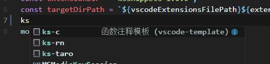

# vscode-template-generator

自定义 vscode 代码模板

## 命令行运行：

```cmd
node ./index.js
```

## 目录介绍

```js
config\              // 配置文件

  extension.js       // vscode扩展目录

  index.js           // 自定义模板

snippets\            // 自定义代码模板

  ks-c

  ...

src\

index.js             // 入口文件

package.json

README.md            // 项目描述

```

## 效果



参考链接：

- <https://blog.csdn.net/maokelong95/article/details/54379046#34_Body__100>
- <https://code.visualstudio.com/docs/editor/userdefinedsnippets>
- <http://nodejs.cn/api/fs.html#fs_class_fs_writestream>